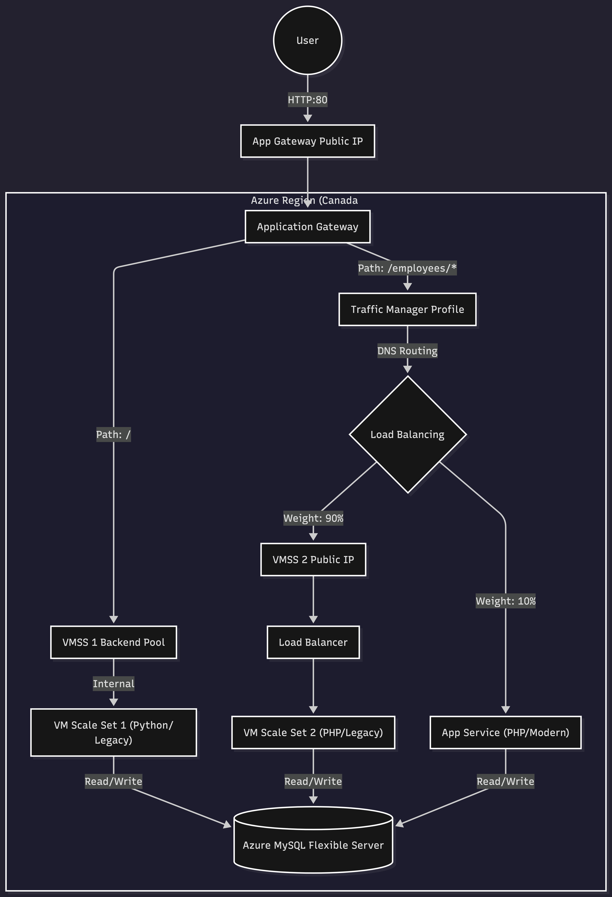

# Strangler Fig Pattern Implementation on Azure

## Project Overview
This project implements the **Strangler Fig Pattern** to modernize a legacy application architecture on Microsoft Azure. The architecture demonstrates a gradual migration strategy where traffic is routed between a legacy system (VM Scale Sets) and a modern system (Azure App Service) using an Application Gateway and Traffic Manager.

## Architecture
The solution consists of the following components:
- **Application Gateway**: Serves as the single entry point, handling path-based routing.
  - Root path (`/*`) is routed to the Legacy Web App (VMSS).
  - `/employees/*` path is routed to a Traffic Manager profile.
- **Traffic Manager**: Implements weighted routing (Canary release style) between:
  - **Legacy Backend**: VM Scale Set running PHP/MySQL (90% traffic).
  - **Modern Backend**: Azure App Service running PHP (10% traffic).
- **Azure MySQL Flexible Server**: Centralized database for both legacy and modern implementations.

Architecture Diagram:


## Prerequisites
- [Terraform](https://www.terraform.io/)
- [Azure CLI](https://docs.microsoft.com/en-us/cli/azure/install-azure-cli)

## Configuration

1.  **Environment Variables**:
    Copy the example environment file and update it with your Azure details.
    ```bash
    cp scripts/.env.example scripts/.env
    ```

2.  **Edit `.env`**:
    Open `scripts/.env` and provide your specific configuration:
    -   `TF_VAR_location`: Azure Region (e.g., `canadacentral`).
    -   `ARM_SUBSCRIPTION_ID`: Your Azure Subscription ID.
    -   `TF_VAR_db_password`: A strong password for the MySQL database.
    -   `TF_VAR_ssh_public_key_path`: Path to your public SSH key (e.g., `~/.ssh/id_rsa.pub`).

## Quick Start
1.  **Permissions**:
    ```bash
    chmod +x scripts/deploy.sh
    ```

2. **Initialize**:
   ```bash
   ./scripts/deploy.sh init
   ```

3. **Deploy**:
   ```bash
   ./scripts/deploy.sh apply
   ```

## Repository Structure
```
.
├── infra/                  # Terraform configuration
│   ├── network.tf          # Network resources
│   ├── compute.tf          # Compute resources (VMSS, App Service)
│   ├── database.tf         # Database resources
│   └── routing.tf          # Traffic Manager & App Gateway
├── docs/                   # Documentation
└── scripts/                # Utility scripts
```

## License
This project is part of the Cloud Computing curriculum at the University of Texas.
